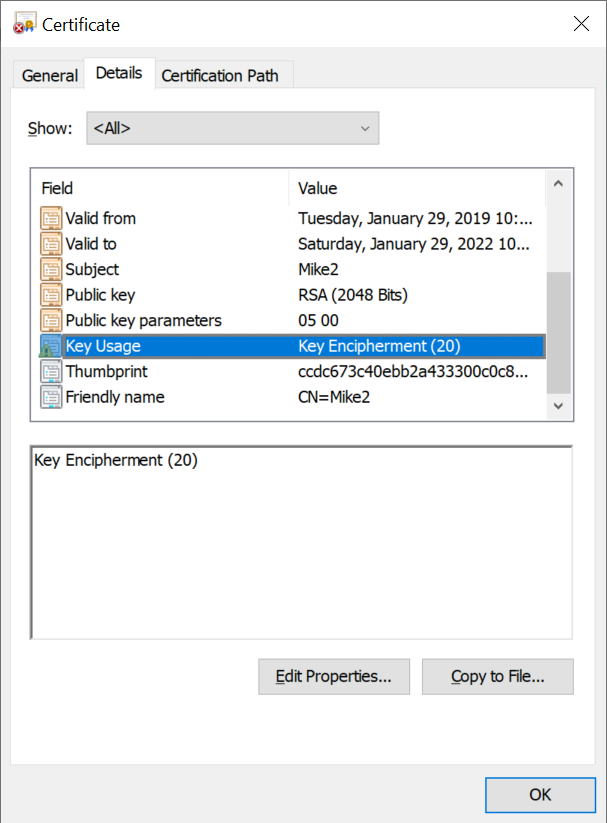

# How can this class library help me?

Have you ever encountered situations where your application needs access to sensitive information in order to function? Connection strings... impersonation passwords... API keys... I'm sure you can think of other examples.  
Certificate-based encryption is an excellent way to protect such information because it greatly reduces the "Turtles all the way down" problem.  Sure, you can implement a quick-and-dirty AES encryption method, but where are you going to store the encryption key?  Not the source code; lord knows who else has access to THAT!  So, why not encrypt the encryption key?  Well, where are you going to store the key to unlock the key?  ...And on and on it goes!

The Windows Cryptographic API (CAPI) store is a far better place to store encryption keys.  Not only does CAPI ensure that your key is not freely accessible sitting on a file system somewhere, but it intrinsically provides access control.  This library allows you to load certificates and keys from either the LocalMachine or CurrentUser CAPI store.  CurrentUser is the advisable alternative if your application runs in the context of a Windows account (either local or Active Directory-based) as keys in that store are only accessible by the owner's account on that particular machine.  The LocalMachine store, on the other hand, is accessible by any user who has administrative privileges on the machine.

# OK, but certificates are a pain.  How do I get one?

To get you started, this library allows you to create a "self-signed" certificate using a single method call.  If you want to get serious about certificate validity, you can use this library with a standard TLS (formerly known as SSL) certificate from any of the well known providers (such as Entrust, Verisign, Comodo and GoDaddy).  Your organization may also have it's own internal PKI, from which you should easily be able to obtain a compatible certificate.  The only prerequisites are that the certificate must be non-expired and it must contain *Key Encipherment* in its _Key Usages_ extension:

# What if I get stuck?

We're always happy to help you get the most out of this class library! Send an Email to [X509Crypto@gmail.com](mailto:x509crypto@gmail.com).
