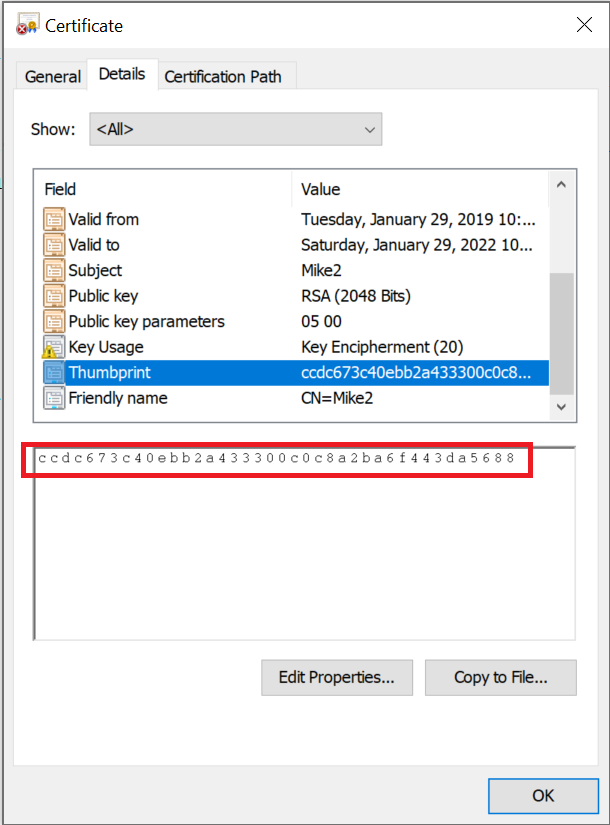

# How can this class library help me?

Have you ever encountered situations where your application needs access to sensitive information in order to function? Connection strings... impersonation passwords... API keys... I'm sure you can think of other examples.  
Certificate-based encryption is an excellent way to protect such information because it greatly reduces the "Turtles all the way down" problem.  Sure, you can implement a quick-and-dirty AES encryption method, but where are you going to store the encryption key?  Not the source code; lord knows who else has access to THAT!  So, why not encrypt the encryption key?  Well, where are you going to store the key to unlock the key?  ...And on and on it goes!

Leveraging asymmetric encryption and the built-in security of the Windows Cryptographic API (CAPI) is a far better approach to managing encryption keys than hiding them in plain site. CAPI natively ensures that your private keys are protected by many layers of encryption, most of which are completely transparent to you as the key owner.  

The X509Crypto library allows you to easily leverage certificates and keys from either the LocalMachine or CurrentUser CAPI store. Certificates are identified to the library via their thumbprint value:

In a nutshell, if you know how to copy and paste text, then you can use this library!

# OK, but certificates are a pain.  How do I get one?

To get you started, you can use our companion [command-line interface](../downloads/X509Crypto_CLI_v1.0.1.zip) to generate a "self-signed" certificate.  If you want to get serious about certificates and Public Key Infrastructure (PKI), you can use this library with a standard TLS (formerly known as SSL) certificate from any of the well known providers (such as Entrust, Verisign, Comodo and GoDaddy).  Your organization may also have it's own internal PKI, from which you should easily be able to obtain a compatible certificate.  The only prerequisites are that the certificate must be non-expired and it must contain *Key Encipherment* in its _Key Usages_ extension:

# What if I get stuck?

We're always happy to help you get the most out of this class library! Send any questions or comments to [x509cryptohelp@gmail.com](mailto:x509cryptohelp@gmail.com).
